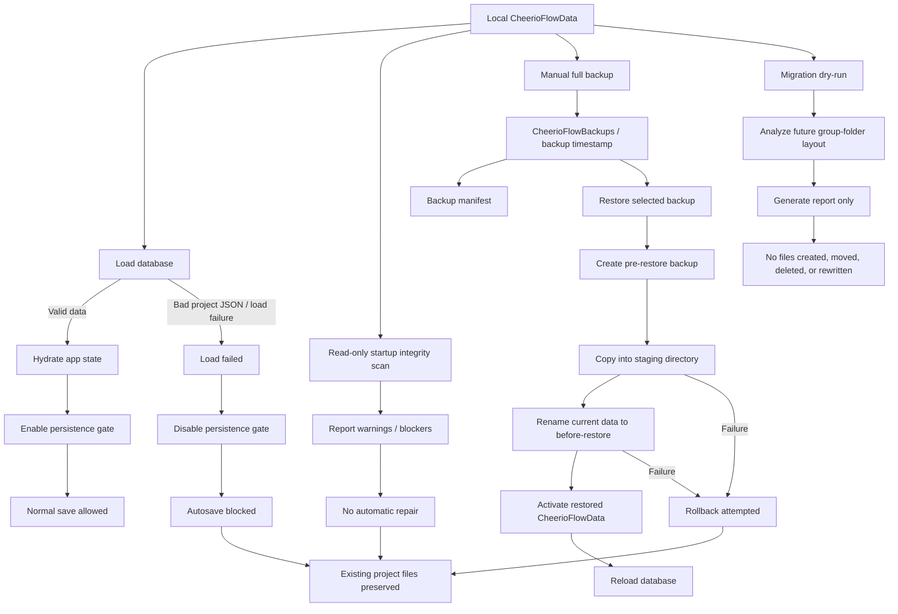

# Cheerio Flow

Local-first desktop research workflow planning tool built with Tauri, React, TypeScript, Rust, React Flow, and KaTeX.

Cheerio Flow is designed for researchers, students, and technical writers who need to plan complex research processes visually: concepts, equations, assumptions, datasets, experiments, arguments, dependencies, and presentation structure can be arranged as editable nodes and arrows on a local canvas.

The project is in active development, with v0.1.6 introducing atomic save and a storage operation console, building on v0.1.5's group-folder migration and v0.1.4's data-safety foundation.

## Current version

```text
v0.1.6 — Atomic Save & Storage Operation Console
```

v0.1.6 introduces **atomic writes for active JSON files** and a **Storage Operation Console**, building on the v0.1.5 Group Folder Migration and v0.1.4 Data Safety Foundation.

### v0.1.6 highlights

#### Atomic save for active data

All active JSON files now use atomic write (write-temp → flush → sync_all → verify → rename → verify):

- Active project JSON files.
- `groups.json`.
- `app-state.json`.
- Fresh workspace bootstrap active JSON.

Temp files are named `.<original-filename>.tmp` (for example `.app-state.json.tmp`, `.groups.json.tmp`, `.project-a.json.tmp`) and live in the same directory as the target file.

Boundaries:

- Pre-rename failure preserves the old target file.
- Post-rename verification failure is detected and returned as an error.
- v0.1.6 does **not** implement post-rename rollback.
- v1 flat project saves remain in v1 layout.
- v2 group-folder project saves remain in v2 layout.
- v1 autosave does **not** automatically migrate to v2.
- v2 group-move stale quarantine behavior is preserved.

#### Storage Operation Console

A read-only modal/dialog opened by clicking the bottom save/status area:

- Displays recent storage events from the in-memory ring buffer.
- Supports **Copy Log**, **Clear**, **Close**, and **Escape** dismissal.
- Ctrl radial menu is suppressed while the console is open; returns to normal on canvas after closing.
- The console is read-only — it has no Restore, Migration, Delete, or Repair buttons.

#### StorageEvent / Operation Log Buffer

- Frontend in-memory ring buffer (capacity **512**).
- Not persisted — cleared on app restart.
- Observes `load`, `save`, `backup`, `restore`, `migration` (dry-run), `storage-root`, and `console` events.
- This is an **observability aid**, not a persistent audit log.

#### Manual desktop validation

v0.1.6 completed manual desktop smoke testing in the **real Tauri desktop window** (browser fallback is not a valid desktop verification environment):

| Test | Name | Result |
|------|------|--------|
| S5-T1 | Storage Console Open | PASS |
| S5-T2 | Copy Log (Real Tauri) | PASS |
| S5-T3 | Clear Console | PASS |
| S5-T4 | Close / Escape | PASS |
| S5-T5 | Ctrl Radial Scope | PASS |
| S5-T6 | Fresh v2 Bootstrap | PASS |
| S5-T7 | v2 Normal Save | PASS |
| S5-T8 | v1 Autosave No Migration | PASS |
| S5-T9 | v2 Group Move Stale Quarantine | PASS |
| S5-T10 | Bad JSON Load Failed | PASS |
| S5-T11 | Duplicate Project ID Load Failed | PASS |
| S5-T12 | Stale .tmp Not Loaded as Project | PASS |

Full report: `docs/V0.1.6_MANUAL_DESKTOP_SMOKE_TEST_REPORT.md`

#### Validation summary

```text
pnpm exec tsc --noEmit        # Passed
pnpm build                    # Passed (existing Vite chunk-size warning only)
cargo fmt --check             # Passed
cargo check                   # Passed (no warnings)
cargo test                    # 30 passed, 0 failed
```

Final read-only review found no blockers.

#### v0.1.5 recap (foundation for v0.1.6)

v0.1.6 is built on the v0.1.5 migration engine:

- **dataVersion 2** group-folder layout.
- Dry-run + **MIGRATE** confirmation + backup + staging + verification + rollback.
- v1 workspaces are fully supported — no automatic migration.
- Duplicate project IDs and bad JSON block load and migration.

## What this project does

Cheerio Flow provides a local desktop workspace for building research process diagrams.

Core use cases include:

* Planning a research project structure.
* Mapping assumptions, methods, experiments, datasets, conclusions, and open problems.
* Creating visual dependency graphs between modules.
* Drafting report, paper, thesis, or presentation logic.
* Keeping project files local as JSON data.
* Backing up and restoring local project data before risky changes.
* Previewing future storage migrations before they are applied.

This is not a cloud service. Cheerio Flow is designed as a local-first desktop application.

## What v0.1.4 fixes

v0.1.4 was created to solve one central problem:

```text
Before changing the project storage layout, the application must first become safe against accidental data loss.
```

This release adds protection around several high-risk areas.

### 1. Destructive save prevention after load failure

A previous failure mode was identified:

```text
Bad project JSON
→ load failed
→ frontend state could become empty
→ autosave could persist empty projects
→ stale cleanup could delete project files
```

v0.1.4 adds a persistence gate:

```text
loadedRef + canPersistRef
```

The app now refuses to save after a failed load until a valid database has been loaded again.

The Rust save path also refuses empty project-list payloads as a defensive measure.

### 2. Read-only startup integrity scan

On startup, the app performs a read-only integrity scan.

The scan checks for issues such as:

* Project file stem and project ID mismatch.
* Duplicate project IDs.
* Invalid group references.
* Missing project references in groups.
* Inconsistent group membership metadata.

The scan does not repair data automatically.

It only reports issues so that future repair or migration tools can be built safely.

### 3. Manual full backup

v0.1.4 adds manual full backup creation.

A backup copies the current `CheerioFlowData` folder into a sibling backup directory:

```text
CheerioFlowBackups/
  backup-YYYYMMDD-HHMMSS/
    CheerioFlowData/
    backup-manifest.json
```

The backup system is conservative:

* Reads from the source data folder.
* Writes to a sibling backup folder.
* Skips symlinks.
* Skips temporary and lock files.
* Uses atomic backup directory creation to avoid timestamp collision.
* Writes a backup manifest.

### 4. Restore from full backup

v0.1.4 adds restore from backup.

Restore is protected by:

* User confirmation.
* Pre-restore backup.
* Staging directory.
* Rename-based replacement.
* Rollback on failure.
* Backup ID validation to reject path traversal.

Restore does not delete the previous data directory directly. The previous data directory is moved aside with a `before-restore` name.

### 5. Migration dry-run

v0.1.4 introduces a read-only dry-run plan for the future v0.1.5 group-folder migration.

The future target layout is expected to be:

```text
CheerioFlowData/
  projects/
    ungrouped/
      {project-id}.json
    groups/
      {group-id}/
        {project-id}.json
  groups.json
  app-state.json
```

The dry-run command does not create folders, copy files, rename files, delete files, write JSON, or modify `dataVersion`.

It only generates a migration report.

### 6. Native storage parent folder picker

v0.1.4 adds a native folder picker through the official Tauri dialog plugin.

The picker only fills the storage root input field.

It does not automatically apply, switch, save, load, restore, repair, or migrate data.

## Supported environment

Primary tested environment:

```text
Windows 11
Tauri desktop application
React + TypeScript frontend
Rust backend through Tauri
pnpm package manager
```

Recommended development requirements:

```text
Node.js LTS
pnpm
Rust stable toolchain
Tauri platform dependencies
Microsoft C++ Build Tools on Windows
WebView2 Runtime on Windows
```

Not fully validated yet:

```text
macOS production packaging
Linux production packaging
Large-scale multi-thousand-node project files
Collaborative editing
Cloud synchronization
```

Cheerio Flow is currently a local desktop prototype. Treat it as early-stage software and keep backups of important project data.

## Quick start

Install dependencies:

```bash
pnpm install
```

Run the frontend development server:

```bash
pnpm dev
```

Run the Tauri desktop development app:

```bash
pnpm desktop:dev
```

Build the frontend:

```bash
pnpm build
```

Build the desktop app:

```bash
pnpm desktop:build
```

Desktop development and desktop packaging require a working Rust/Tauri environment.

## Important warnings

* This is early-stage local-first research software.
* Always back up important project data.
* Do not manually edit project JSON files while the app is running.
* Do not use browser localStorage data as long-term storage.
* Migration dry-run is a read-only preview. Real migration requires typing MIGRATE and clicking Apply Migration.
* Do not choose `CheerioFlowData` itself as the storage parent folder. Choose its parent folder instead.
* If startup reports data integrity issues, create a backup before attempting manual repair.
* If restore fails, inspect the generated error message and the `before-restore` directory before retrying.
* v0.1.4 intentionally avoids automatic repair and automatic migration.

## Main features

| Feature                         |                Status | Notes                                         |
| ------------------------------- | --------------------: | --------------------------------------------- |
| Local desktop app               |           Implemented | Built with Tauri                              |
| Project creation                |           Implemented | Creates local project JSON                    |
| Project deletion                |           Implemented | Uses explicit delete command                  |
| Project switching               |           Implemented | Loads selected project into canvas            |
| Project metadata editing        |           Implemented | Title, category, group, pinned state          |
| Group creation/editing/deletion |           Implemented | Stored in `groups.json`                       |
| Project grouping                |           Implemented | Projects can be assigned to groups            |
| Canvas modules                  |           Implemented | Rectangle, triangle, diamond, circle, ellipse |
| Canvas arrows                   |           Implemented | Source/target direction preserved             |
| Module dragging                 |           Implemented | Arrow positions follow nodes                  |
| Module properties panel         |           Implemented | Content, type, shape, note, enabled state     |
| Arrow properties panel          |           Implemented | Type, note, enabled state, direction          |
| KaTeX rendering                 |           Implemented | Optional LaTeX rendering for module content   |
| Local JSON persistence          |           Implemented | Tauri mode writes to local files              |
| Browser fallback storage        |           Implemented | Development fallback through localStorage     |
| Manual full backup              | Implemented in v0.1.4 | Creates `CheerioFlowBackups`                  |
| Restore from backup             | Implemented in v0.1.4 | Uses staging and rollback                     |
| Startup integrity scan          | Implemented in v0.1.4 | Read-only                                     |
| Migration dry-run               | Implemented in v0.1.4 | Read-only preview                             |
| Native folder picker            | Implemented in v0.1.4 | Does not auto-switch                          |
| Storage drawer                  | Implemented in v0.1.4 | Session-only UI state                         |
| Project details panel           | Implemented in v0.1.4 | Open/close independently                      |
| CSV preview                     |       Not implemented | Planned future extension                      |
| Image asset import              |       Not implemented | Planned future extension                      |
| Presentation mode               |       Not implemented | Planned future extension                      |
| Real group-folder migration     | Implemented in v0.1.5 | Dry-run + MIGRATE confirmation + backup + staging + rollback |
| Atomic write for active JSON  | Implemented in v0.1.6 | write-temp → flush → sync_all → verify → rename              |
| Storage Operation Console     | Implemented in v0.1.6 | Read-only modal, in-memory event log                         |
| Storage event buffer          | Implemented in v0.1.6 | Frontend ring buffer, capacity 512                           |

## Data Safety Demo

Cheerio Flow treats local data safety as a first-class design goal.

v0.1.4 focused on preventing accidental local data loss caused by failed loads, broken JSON files, unsafe saves, restore failures, or future storage migrations.

v0.1.5 adds the real migration engine with backup enforcement, staging, verification, and rollback, plus duplicate project ID detection, storage error type labels, and Ctrl radial menu canvas scoping. v0.1.6 strengthens active JSON save reliability through atomic writes and adds observability through the Storage Operation Console.



The diagram above shows the intended v0.1.4 safety model:

- failed loads disable persistence instead of saving empty state;
- startup integrity scanning is read-only;
- full backup copies the active data folder before risky operations;
- restore uses pre-restore backup, staging, rename, and rollback;
- migration dry-run produces a report only and does not modify files.

## Data safety features

| Safety feature               | Description                                             |
| ---------------------------- | ------------------------------------------------------- |
| `dataVersion`                | App state records the storage format version (1 or 2).  |
| Load-failed persistence gate | Prevents autosave after failed load.                    |
| Empty-save rejection         | Rust save path refuses empty project-list payloads.     |
| Read-only startup scan       | Detects integrity issues without writing to disk.       |
| Manual backup                | Copies data to timestamped backup folder.               |
| Backup manifest              | Records backup metadata.                                |
| Restore confirmation         | Requires explicit user confirmation before restore.     |
| Pre-restore backup           | Creates backup before restoring another backup.         |
| Staging restore              | Restores into staging first, then renames.              |
| Rollback handling            | Attempts rollback if final replacement fails.           |
| Path traversal defense       | Backup IDs and project/group IDs are validated.         |
| Migration dry-run            | Previews migration plan without modifying files.        |
| Migration staging + verify   | Writes v2 layout to staging, verifies before activation.|
| Before-migration preservation| Preserves pre-migration data as `CheerioFlowData.before-migration-*`. |
| v1/v2 classification         | Workspace layout is classified before load/save routing.|
| Duplicate project ID guard   | Two files with same `project.id` block load and migration.|
| Stale migration report guard | Old dry-run reports are cleared when switching workspaces.|
| Storage error type labels    | Distinguishes Load/Save/Restore/Migration failed in status bar.|
| Ctrl radial menu scope       | Module creation radial menu only opens over the canvas. |
| Atomic write for active JSON | write-temp → flush → sync_all → verify → rename for active saves. |
| Storage operation event buffer | In-memory ring buffer observes storage operations.    |
| Symlink avoidance            | All file operations reject and skip symlinks.           |

## Storage model

Cheerio Flow uses a storage parent folder.

The app creates `CheerioFlowData` inside that parent folder.

For example, if the chosen storage parent folder is:

```text
C:\Users\Alice\AppData\Roaming\com.cheerioflow.desktop
```

then the actual data directory is:

```text
C:\Users\Alice\AppData\Roaming\com.cheerioflow.desktop\CheerioFlowData
```

Do not choose `CheerioFlowData` itself as the storage parent folder.

Choose its parent folder.

## Current data layout

v0.1.5 data layout (dataVersion 2, group-folder):

```text
CheerioFlowData/
  projects/
    ungrouped/
      {project-id}.json
    groups/
      {group-id}/
        {project-id}.json
  groups.json
  app-state.json
```

Legacy v1 data layout (dataVersion 1, still supported for loading and saving):

```text
CheerioFlowData/
  projects/
    {project-id}.json
  groups.json
  app-state.json
```

Backup layout:

```text
CheerioFlowBackups/
  backup-YYYYMMDD-HHMMSS/
    CheerioFlowData/
      projects/
        ...
      groups.json
      app-state.json
    backup-manifest.json
```

Before-migration preservation (created by v1 → v2 migration):

```text
CheerioFlowData.before-migration-YYYYMMDD-HHMMSS/
  projects/
    ...
  groups.json
  app-state.json
```

v0.1.5 performs this migration only through explicit user action (dry-run + MIGRATE confirmation).

## Backup and restore

### Create backup

Use the app UI:

```text
Storage → Backup → Create Full Backup
```

A backup is created under:

```text
CheerioFlowBackups/
  backup-YYYYMMDD-HHMMSS/
```

The backup contains:

```text
CheerioFlowData/
backup-manifest.json
```

### Restore backup

Use the app UI:

```text
Storage → Restore
```

Restore is intentionally conservative.

It performs:

```text
selected backup
→ pre-restore backup
→ staging copy
→ rename current CheerioFlowData to before-restore directory
→ rename staging CheerioFlowData to active CheerioFlowData
→ reload database
```

If restore fails during replacement, the app attempts rollback.

### Restore warning

Restore is a powerful operation.

Before restoring, make sure:

* You know which backup you selected.
* You have enough disk space.
* The app is not being modified by another process.
* The backup is from a compatible Cheerio Flow version.

## Migration dry-run

v0.1.4 includes a dry-run planner for the future group-folder migration.

The dry-run checks:

* Project files.
* Project IDs.
* Group IDs.
* Group membership references.
* Target path collisions.
* Unsafe path segments.
* Duplicate IDs.
* Broken or unreadable JSON files.

The dry-run produces:

* Planned operations.
* Warnings.
* Blockers.
* Source data version.
* Target data version.
* Summary counts.

It does not write anything to disk.

## Repository layout

```text
.
├── README.md
├── LICENSE
├── package.json
├── pnpm-lock.yaml
├── index.html
├── src/
│   ├── App.tsx
│   ├── integrity.ts
│   ├── storage.ts
│   ├── types.ts
│   ├── utils.ts
│   └── styles.css
├── src-tauri/
│   ├── Cargo.toml
│   ├── tauri.conf.json
│   └── src/
│       └── lib.rs
└── ...
```

Main files:

| File                        | Role                                                                        |
| --------------------------- | --------------------------------------------------------------------------- |
| `src/App.tsx`               | Main UI, project list, canvas, modules, arrows, panels, backup/restore UI.  |
| `src/types.ts`              | TypeScript data model for projects, groups, modules, arrows, and app state. |
| `src/storage.ts`            | Tauri command wrapper and browser fallback storage.                         |
| `src/integrity.ts`          | Read-only integrity scan logic.                                             |
| `src/utils.ts`              | ID, time, default project/group/module helpers.                             |
| `src/styles.css`            | Application layout and visual styling.                                      |
| `src-tauri/src/lib.rs`      | Rust backend for local storage, backup, restore, and migration dry-run.     |
| `src-tauri/tauri.conf.json` | Tauri application configuration.                                            |
| `package.json`              | Frontend and Tauri scripts.                                                 |
| `LICENSE`                   | MIT License.                                                                |

## Tauri commands

The Rust backend provides local filesystem operations through Tauri commands.

Important command categories:

| Category               | Role                                                    |
| ---------------------- | ------------------------------------------------------- |
| Database load/save     | Load and save local project database.                   |
| Storage root switching | Switch the storage parent folder and reload data.       |
| Project deletion       | Explicitly delete a project file.                       |
| Backup creation        | Create full timestamped backup.                         |
| Backup listing         | List existing backups read-only.                        |
| Restore                | Restore selected full backup with staging and rollback. |
| Migration dry-run      | Generate read-only migration preview.                   |
| Migration apply        | Execute group-folder migration with staging and rollback.|

Normal save paths do not perform stale project cleanup.

Project file deletion is reserved for explicit project deletion.

## What gets changed locally

Cheerio Flow writes only to the selected local storage area.

| Local path                                               | Purpose                                          |
| -------------------------------------------------------- | ------------------------------------------------ |
| `CheerioFlowData/projects/ungrouped/{id}.json`           | Ungrouped project files (v2 layout).             |
| `CheerioFlowData/projects/groups/{gid}/{id}.json`        | Grouped project files (v2 layout).               |
| `CheerioFlowData/projects/{project-id}.json`             | Legacy v1 flat project files (still supported).  |
| `CheerioFlowData/groups.json`                            | Group list and project membership metadata.      |
| `CheerioFlowData/app-state.json`                         | UI/app state, including `dataVersion`.           |
| `CheerioFlowData/.cheerio/stale-project-files/`          | Quarantined stale project files after group move.|
| `CheerioFlowBackups/backup-*/CheerioFlowData/`           | Full backup copy of data folder.                 |
| `CheerioFlowBackups/backup-*/backup-manifest.json`       | Backup metadata.                                 |
| `CheerioFlowData.before-migration-*`                     | Pre-migration data preserved by migration.       |
| `CheerioFlowData.before-restore-*`                       | Previous data folder moved aside during restore. |

Cheerio Flow does not require a server for these operations.

## Validation

### v0.1.5 validation

Build validation passed:

```text
git diff --check              # No whitespace errors
pnpm exec tsc --noEmit        # Passed
pnpm build                    # Passed
cargo fmt --check             # Passed
cargo check                   # Passed
cargo test                    # 12 passed, 0 failed
pnpm desktop:build            # MSI + NSIS installers produced
```

Desktop packaging produced Windows installer outputs through Tauri build.

Manual acceptance testing — Test A-J all passed. These are human-operated manual tests, not automated CI:

- **Test A:** Fresh workspace initializes as `dataVersion: 2` with group-folder layout.
- **Test B:** v1 load + autosave does not fake-upgrade to v2.
- **Test C:** v1 dry-run produces correct 1 → 2 migration plan.
- **Test D:** Explicit migration applies v2 layout with backup and before-migration copy.
- **Test E:** v2 normal save preserves group-folder layout.
- **Test F:** v2 project group move rewrites canonical path safely.
- **Test G:** Already migrated v2 workspace reports no migration needed.
- **Test H:** Bad JSON / stale migration preview — bug found, fixed, and re-tested.
- **Test I:** Duplicate project ID blocks migration and leaves disk unchanged.
- **Test J:** Restore old v1 backup after migration returns to v1 without auto-migrate.

Post A-J manual findings fixed and verified:

- Ctrl radial menu scoped to canvas only.
- Load failures shown as Load failed, not Save failed (storage error type labels).

v0.1.5-rc1 smoke test passed.

Final read-only review found no P0/P1 blockers.

Full manual test report: `docs/MANUAL_TEST_REPORT_v0.1.5_GROUP_FOLDER_MIGRATION.md`

### v0.1.4 validation

v0.1.4 release closeout validation passed (same build checks as above).

v0.1.4 safety validation covered:

* Load failure does not trigger destructive empty save.
* Bad project JSON does not cause project file deletion.
* Backup creation is read-only toward source data.
* Backup directory allocation avoids timestamp collision.
* Restore uses pre-restore backup, staging, rename, and rollback.
* Migration dry-run remains read-only.
* Native folder picker does not automatically switch storage root.
* Storage drawer state remains session-only.
* Project Details panel does not alter project persistence.
* Backup result panel sizing and wrapping were fixed in the final release candidate.

## Known limitations

Current limitations:

* CSV import and data-table preview are not implemented.
* Image node asset import is not implemented.
* Presentation mode is not implemented.
* Browser localStorage fallback is for development convenience, not production storage.
* The app is not a collaborative editor.
* There is no cloud sync.
* There is no plugin system yet.
* Large project performance still needs further testing.
* Automatic repair is intentionally not implemented in v0.1.4.
* v0.1.6 does **not** include: single-writer workspace lock, checksum manifest, Recovery Center, pseudo-server backup root, GitHub backup adapter, persistent operation log, automatic stale `.tmp` cleanup, directory fsync hardening, stronger Windows-specific write hardening, post-rename rollback, kill-process save interruption validation, or end-to-end encryption.
* Backup, restore, migration, and quarantine remain on the v0.1.5 safety model and were not rewritten in v0.1.6.
* Interrupted-save kill-process test was not run in Slice 5.

## Roadmap

Planned directions:

### v0.1.6 — Atomic Save & Storage Operation Console ✅

Completed. Introduced atomic write for all active JSON files (write-temp → flush → sync_all → verify → rename) and a read-only Storage Operation Console with an in-memory ring buffer for storage event observability. Manual desktop smoke testing passed in the real Tauri desktop window (12/12 tests PASS). See the Current version section above for details.

### Future features

Possible future extensions:

* CSV import and preview.
* Image node import and asset management.
* Presentation / meeting mode.
* Export to image or PDF.
* Project templates.
* Search across modules.
* Versioned project history.
* More node types for academic writing and experiment tracking.
* Better diagnostics and repair tools.

## Future Data Reliability

Cheerio Flow has evolved from the v0.1.4 Data Safety Foundation through v0.1.5 Group Folder Migration to v0.1.6 Atomic Save & Storage Operation Console — improving local-first active JSON save reliability and storage operation observability under tested desktop scenarios.

See:

- `docs/DATA_RELIABILITY_ROADMAP.md`
- `docs/IDEAS_DUAL_PLANE_LOCAL_DATA_MODEL.md`

## Development notes

This project was developed with AI-assisted coding support.

All critical data-safety logic was manually reviewed through iterative engineering checks, including:

* Frontend persistence gating.
* Rust save-path hardening.
* Backup behavior.
* Restore behavior.
* Migration dry-run behavior.
* Sidebar and storage UI behavior.

AI assistance was used for implementation support, review prompts, and release organization. The repository contents should still be treated as source code requiring normal human review, testing, and version control discipline.

## Git tags

Release tags:

```text
v0.1.6       Atomic Save & Storage Operation Console
v0.1.5       Group Folder Migration
v0.1.5-rc1   Group Folder Migration release candidate
v0.1.4       Data Safety Foundation
v0.1.4-rc2   Final release candidate with backup result panel sizing fix
v0.1.4-rc1   First release candidate
```

Note:

Each `vX.Y.Z` tag points to its release commit.

Later repository maintenance commits, such as adding `LICENSE` or updating documentation, may exist on `main` or on the release branch after the release tag. This is normal and does not change the release snapshot.

## License

MIT License.

The license applies to the Cheerio Flow source code and documentation in this repository.

See `LICENSE` for details.
