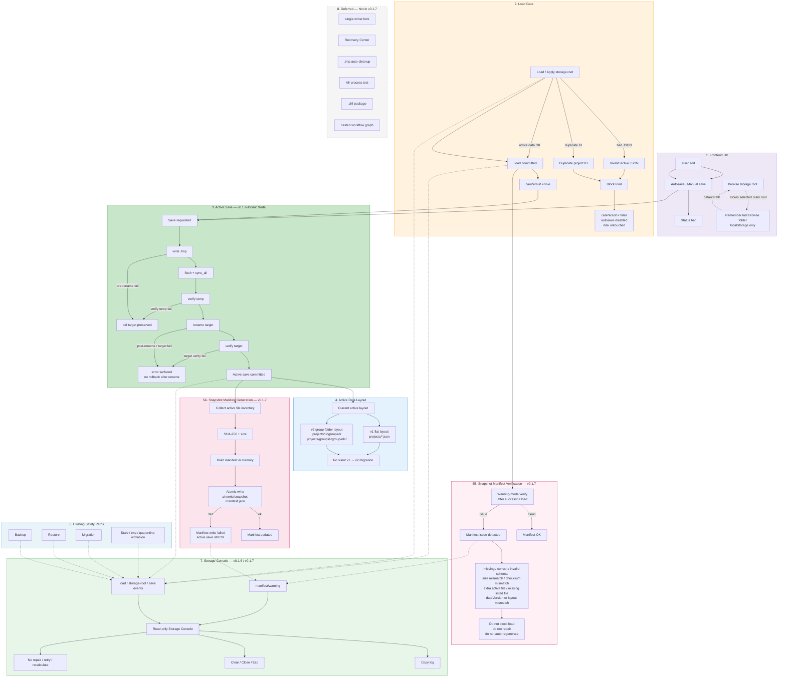

# Cheerio Flow

[English](./README.md) | [中文版](./README_CN.md)

本地优先的桌面科研工作流规划工具，基于 Tauri、React、TypeScript、Rust、React Flow 和 KaTeX 构建。

Cheerio Flow 面向研究员、学生和技术写作者，用于可视化规划复杂研究过程：概念、公式、假设、数据集、实验、论证、依赖关系和展示结构可以以可编辑节点和箭头的形式呈现在本地画布上。

项目处于活跃开发阶段。v0.1.7 引入了快照清单和 SHA-256 完整性警告，建立在 v0.1.6 的原子化保存、v0.1.5 的分组文件夹迁移和 v0.1.4 的数据安全基础之上。

## 当前版本

```text
v0.1.7 — Snapshot Manifest & Integrity Warnings
```

v0.1.7 为活跃工作区文件引入了**快照清单**、**SHA-256 校验和**以及**警告模式加载验证**，基于 v0.1.6 的原子化保存基础。

### v0.1.7 亮点

#### 快照清单

每次成功保存后，Cheerio Flow 会写入一份快照清单：

```
CheerioFlowData/.cheerio/snapshot-manifest.json
```

清单记录每个活跃工作区文件的角色、大小和 SHA-256 校验和。覆盖范围：

- `app-state.json`
- `groups.json`
- 活跃项目 JSON 文件（仅规范路径）

清单明确排除备份文件、陈旧隔离文件、`.tmp` 文件和非规范项目路径。

清单使用原子化写入（与活跃数据相同的 write-temp → flush → sync_all → verify → rename 流程）。

#### 警告模式加载验证

成功加载后，Cheerio Flow 以**警告模式**验证快照清单。清单问题永远不会阻止有效活跃数据的访问：

| 场景 | 行为 |
|---|---|
| 清单缺失 | 警告 — 正常加载 |
| 清单损坏（无效 JSON） | 警告 — 正常加载 |
| 校验和不匹配 | 警告 — 正常加载 |
| 大小不匹配 | 警告 — 正常加载 |
| 额外活跃文件（磁盘有但清单无） | 警告 — 正常加载 |
| 清单列出但磁盘缺失文件 | 警告 — 正常加载 |
| 活跃项目 JSON 损坏 | **阻止** — 加载失败 |
| 重复项目 ID | **阻止** — 加载失败 |

活跃 JSON 加载门禁仍然优先。清单问题警告；活跃数据损坏仍然阻止。

#### 清单写入失败不会导致保存失败

如果清单无法写入（例如权限问题、`.cheerio` 是文件而非目录），活跃保存仍然成功。失败以 `manifest/warning` 形式在 Storage Console 中显示——绝不会显示为 **Save failed**。

#### Storage Console 清单警告

Storage Console（v0.1.6 引入）现在同时显示保存时和加载时的 `manifest/warning` 事件。Console 保持只读——没有修复、重试或重新计算按钮。没有添加 Recovery Center。

#### 警告消息脱敏

所有用户可见的清单警告消息仅使用相对路径。本地绝对路径绝不会暴露在警告文本或 Storage Console 复制输出中。

#### Browse 目录记忆

Browse 文件夹选择器现在将最后一次手动选择的外部存储根目录作为本地 UI 偏好记忆（`localStorage` 键：`cheerio-flow:last-browse-directory`）。这不写入工作区数据，也不影响保存/加载正确性。

### v0.1.6 回顾（v0.1.7 的基础）

v0.1.7 建立在 v0.1.6 原子化保存基础之上：

- **活跃 JSON 原子化写入** — 项目文件、`groups.json`、`app-state.json` 均使用 write-temp → flush → sync_all → verify → rename。
- **Storage Operation Console** — 只读弹窗，显示内存存储事件（Copy Log、Clear、Close、Escape）。
- **存储事件缓冲区** — 前端环形缓冲区（容量 512），不持久化。

### v0.1.5 回顾

v0.1.5 引入了**分组文件夹迁移**引擎：

- **dataVersion 2** 分组文件夹布局。
- Dry-run + MIGRATE 确认 + 备份 + 暂存 + 验证 + 回滚。
- v1 工作区完全支持——不会自动迁移。
- 重复项目 ID 和损坏 JSON 阻止加载和迁移。

## 项目功能

Cheerio Flow 提供一个本地桌面工作区，用于构建研究过程图。

核心用例包括：

* 规划研究项目结构。
* 梳理假设、方法、实验、数据集、结论和未解决问题。
* 创建模块间的可视化依赖图。
* 草拟报告、论文、学位论文或演示逻辑。
* 将项目文件作为 JSON 数据保存在本地。
* 在风险变更前备份和恢复本地项目数据。
* 在实际应用前预览未来的存储迁移方案。

这不是云服务。Cheerio Flow 设计为本地优先的桌面应用。

## v0.1.4 解决的问题

v0.1.4 为解决一个核心问题而创建：

```text
在改变项目存储布局之前，应用必须首先确保不会因意外导致数据丢失。
```

此版本为多个高风险区域添加了保护。

### 1. 加载失败后阻止破坏性保存

此前发现了一种故障模式：

```text
损坏的项目 JSON
→ 加载失败
→ 前端状态可能变为空
→ 自动保存可能持久化空项目
→ 陈旧清理可能删除项目文件
```

v0.1.4 添加了持久化门禁：

```text
loadedRef + canPersistRef
```

应用现在在加载失败后拒绝保存，直到再次加载了有效数据库。

Rust 保存路径也以防御措施拒绝空项目列表载荷。

### 2. 只读启动完整性扫描

启动时，应用执行只读完整性扫描。

扫描检查以下问题：

* 项目文件名称与项目 ID 不匹配。
* 重复项目 ID。
* 无效的分组引用。
* 分组中缺失的项目引用。
* 不一致的分组成员元数据。

扫描不会自动修复数据。

它仅报告问题，以便未来可以安全地构建修复或迁移工具。

### 3. 手动完整备份

v0.1.4 添加了手动完整备份创建。

备份将当前 `CheerioFlowData` 文件夹复制到同级备份目录：

```text
CheerioFlowBackups/
  backup-YYYYMMDD-HHMMSS/
    CheerioFlowData/
    backup-manifest.json
```

备份系统保守设计：

* 从源数据文件夹读取。
* 写入同级备份文件夹。
* 跳过符号链接。
* 跳过临时文件和锁定文件。
* 使用原子化备份目录创建以避免时间戳冲突。
* 写入备份清单。

### 4. 从完整备份恢复

v0.1.4 添加了从备份恢复功能。

恢复受到以下保护：

* 用户确认。
* 恢复前备份。
* 暂存目录。
* 基于重命名的替换。
* 失败时回滚。
* 备份 ID 验证以拒绝路径穿越。

恢复不会直接删除之前的数据目录。之前的数据目录以 `before-restore` 名称移开。

### 5. 迁移预演

v0.1.4 为未来的 v0.1.5 分组文件夹迁移引入了只读预演方案。

预期的目标布局是：

```text
CheerioFlowData/
  projects/
    ungrouped/
      {project-id}.json
    groups/
      {group-id}/
        {project-id}.json
  groups.json
  app-state.json
```

预演命令不会创建文件夹、复制文件、重命名文件、删除文件、写入 JSON 或修改 `dataVersion`。

它只生成迁移报告。

### 6. 原生存储父文件夹选择器

v0.1.4 通过官方 Tauri 对话框插件添加了原生文件夹选择器。

选择器仅填充存储根目录输入字段。

它不会自动应用、切换、保存、加载、恢复、修复或迁移数据。

## 支持环境

主要测试环境：

```text
Windows 11
Tauri 桌面应用
React + TypeScript 前端
通过 Tauri 的 Rust 后端
pnpm 包管理器
```

推荐开发要求：

```text
Node.js LTS
pnpm
Rust stable 工具链
Tauri 平台依赖
Windows 上的 Microsoft C++ Build Tools
Windows 上的 WebView2 Runtime
```

尚未充分验证：

```text
macOS 生产打包
Linux 生产打包
大规模（数千节点）项目文件
协同编辑
云同步
```

Cheerio Flow 目前是本地桌面原型。请将其视为早期软件，并对重要项目数据进行备份。

## 快速开始

安装依赖：

```bash
pnpm install
```

运行前端开发服务器：

```bash
pnpm dev
```

运行 Tauri 桌面开发应用：

```bash
pnpm desktop:dev
```

构建前端：

```bash
pnpm build
```

构建桌面应用：

```bash
pnpm desktop:build
```

桌面开发和桌面打包需要配置 Rust/Tauri 环境。

## 重要警告

* 这是早期阶段的本地优先研究软件。
* 始终备份重要的项目数据。
* 不要在应用运行时手动编辑项目 JSON 文件。
* 不要使用浏览器 localStorage 数据作为长期存储。
* 迁移预演是只读预览。真正的迁移需要输入 MIGRATE 并点击 Apply Migration。
* 不要将 `CheerioFlowData` 本身选为存储父文件夹。应选择它的父文件夹。
* 如果启动时报告数据完整性问题，在尝试手动修复之前先创建备份。
* 如果恢复失败，先检查生成的错误消息和 `before-restore` 目录，再重试。
* v0.1.4 有意避免自动修复和自动迁移。

## 主要功能

| 功能 | 状态 | 备注 |
| ------------------------------- | --------------------: | --------------------------------------------- |
| 本地桌面应用 | 已实现 | 基于 Tauri 构建 |
| 项目创建 | 已实现 | 创建本地项目 JSON |
| 项目删除 | 已实现 | 使用显式删除命令 |
| 项目切换 | 已实现 | 将选中项目加载到画布 |
| 项目元数据编辑 | 已实现 | 标题、分类、分组、固定状态 |
| 分组创建/编辑/删除 | 已实现 | 存储在 `groups.json` 中 |
| 项目分组 | 已实现 | 项目可分配到分组 |
| 画布模块 | 已实现 | 矩形、三角形、菱形、圆形、椭圆 |
| 画布箭头 | 已实现 | 保留来源/目标方向 |
| 模块拖拽 | 已实现 | 箭头位置跟随节点 |
| 模块属性面板 | 已实现 | 内容、类型、形状、备注、启用状态 |
| 箭头属性面板 | 已实现 | 类型、备注、启用状态、方向 |
| KaTeX 渲染 | 已实现 | 可选的 LaTeX 模块内容渲染 |
| 本地 JSON 持久化 | 已实现 | Tauri 模式写入本地文件 |
| 浏览器回退存储 | 已实现 | 开发时通过 localStorage 回退 |
| 手动完整备份 | v0.1.4 实现 | 创建 `CheerioFlowBackups` |
| 从备份恢复 | v0.1.4 实现 | 使用暂存和回滚 |
| 启动完整性扫描 | v0.1.4 实现 | 只读 |
| 迁移预演 | v0.1.4 实现 | 只读预览 |
| 原生文件夹选择器 | v0.1.4 实现 | 不自动切换 |
| 存储抽屉 | v0.1.4 实现 | 仅会话 UI 状态 |
| 项目详情面板 | v0.1.4 实现 | 独立打开/关闭 |
| CSV 预览 | 未实现 | 计划中的扩展 |
| 图片资源导入 | 未实现 | 计划中的扩展 |
| 演示模式 | 未实现 | 计划中的扩展 |
| 真正的分组文件夹迁移 | v0.1.5 实现 | Dry-run + MIGRATE 确认 + 备份 + 暂存 + 回滚 |
| 活跃 JSON 原子化写入 | v0.1.6 实现 | write-temp → flush → sync_all → verify → rename |
| Storage Operation Console | v0.1.6 实现 | 只读弹窗，内存事件日志 |
| 存储事件缓冲区 | v0.1.6 实现 | 前端环形缓冲区，容量 512 |
| 快照清单 | v0.1.7 实现 | 活跃工作区文件清单，带 SHA-256 校验和 |
| 警告模式加载验证 | v0.1.7 实现 | 清单问题警告；活跃数据损坏仍然阻止 |
| 清单写入失败安全性 | v0.1.7 实现 | 清单失败不会导致活跃保存失败 |
| Browse 目录记忆 | v0.1.7 实现 | localStorage UI 偏好，非工作区数据 |

## 数据安全架构

Cheerio Flow 将本地数据安全作为一等设计目标。下图展示了截至 v0.1.7 的分层数据安全架构。

v0.1.7 在活跃保存和备份/恢复之间增加了**快照清单层**：每次成功保存后，带 SHA-256 校验和的清单被原子化写入。加载时验证以警告模式运行——清单问题绝不会阻止有效活跃数据的访问。v0.1.6 的原子化写入和 Storage Console 基础保持不变。



### 如何阅读此图

**第 1 层（Frontend UX）：**

- 用户编辑触发自动保存（约 2 秒防抖）或手动保存，首先通过加载门禁。
- Browse 将上次手动选择的外部存储根目录作为 localStorage 专用 UI 偏好记忆——不写入工作区数据。

**第 2 层（Load Gate）：**

- 加载失败（损坏 JSON 或重复项目 ID）会禁用持久化门禁——自动保存被阻止，现有文件在磁盘上保持不变。
- 加载成功打开门禁（`canPersist = true`）并触发警告模式清单验证。

**第 3 层（Active Save — v0.1.6 原子化写入）：**

- 保存通过原子化写入项目 JSON、`groups.json` 和 `app-state.json`：`.tmp` → flush → `sync_all` → 验证临时文件 → 重命名为正式位置 → 验证目标文件。
- **重命名前失败**保留旧目标文件。**重命名后验证失败**被检测并报告，但 v0.1.6 未实现重命名后回滚。

**第 4 层（Active Data Layout）：**

- 活跃数据保持其原生布局：v1 扁平或 v2 分组文件夹。v1 自动保存**不会**静默迁移到 v2。

**第 5A 层（Snapshot Manifest Generation — v0.1.7）：**

- 每次成功保存后：收集清单 → SHA-256 + 大小 → 构建清单 → 原子化写入 `.cheerio/snapshot-manifest.json`。
- 清单写入失败**不会**导致活跃保存失败；以 `manifest/warning` 形式显示。

**第 5B 层（Snapshot Manifest Verification — v0.1.7）：**

- 加载成功后，清单以**警告模式**验证：缺失、损坏、校验和不匹配、大小不匹配、额外文件或清单列出但缺失的文件产生警告——绝不会阻止加载。
- 不修复、不加载时自动重新生成。

**第 6 层（Existing Safety Paths — v0.1.7 未重写）：**

- 备份、恢复、迁移和陈旧/tmp/隔离排除保持在 v0.1.5 安全模型上。

**第 7 层（Storage Console — v0.1.6/v0.1.7）：**

- 只读弹窗，显示 load/save/storage-root 事件和 `manifest/warning` 事件。
- 支持复制日志、清除、关闭、Escape。没有修复/重试/重新计算功能。

**第 8 层（Deferred — v0.1.7 未包含）：**

- 单写者锁、Recovery Center、`.tmp` 自动清理、杀进程测试、`.chf` 包、嵌套工作流图在 v0.1.7 中**未实现**。

**总结：** v0.1.7 在 v0.1.6 原子化保存基础上增加了快照清单完整性观察。它**不**声称零数据丢失、防崩溃保证或硬件故障保护。

## 数据安全特性

| 安全特性 | 描述 |
| ---------------------------- | ------------------------------------------------------- |
| `dataVersion` | 应用状态记录存储格式版本（1 或 2）。 |
| 加载失败持久化门禁 | 加载失败后阻止自动保存。 |
| 空保存拒绝 | Rust 保存路径拒绝空项目列表载荷。 |
| 只读启动扫描 | 不写入磁盘的情况下检测完整性问题。 |
| 手动备份 | 将数据复制到带时间戳的备份文件夹。 |
| 备份清单 | 记录备份元数据。 |
| 恢复确认 | 恢复前需要明确的用户确认。 |
| 恢复前备份 | 恢复另一备份前先创建备份。 |
| 暂存恢复 | 先恢复到暂存区，再重命名。 |
| 回滚处理 | 最终替换失败时尝试回滚。 |
| 路径穿越防御 | 备份 ID 和项目/分组 ID 经过验证。 |
| 迁移预演 | 不修改文件的情况下预览迁移方案。 |
| 迁移暂存 + 验证 | 先写入 v2 布局到暂存区，验证后再激活。 |
| 迁移前保留 | 将迁移前数据保留为 `CheerioFlowData.before-migration-*`。 |
| v1/v2 分类 | 加载/保存路由前对工作区布局进行分类。 |
| 重复项目 ID 防护 | 两个文件有相同 `project.id` 时阻止加载和迁移。 |
| 陈旧迁移报告防护 | 切换工作区时清除旧的预演报告。 |
| 存储错误类型标签 | 在状态栏区分 Load/Save/Restore/Migration failed。 |
| Ctrl 径向菜单作用域 | 模块创建径向菜单仅在画布上方打开。 |
| 活跃 JSON 原子化写入 | 活跃保存使用 write-temp → flush → sync_all → verify → rename。 |
| 存储操作事件缓冲区 | 内存环形缓冲区观察存储操作。 |
| 快照清单 | 活跃工作区文件清单，带 SHA-256 校验和，保存后原子化写入。 |
| 警告模式验证 | 清单问题警告；绝不阻止有效的活跃数据加载。 |
| 清单写入失败安全性 | 清单失败不会导致活跃保存失败；以警告形式显示。 |
| 清单路径脱敏 | 警告消息仅使用相对路径；不暴露本地绝对路径。 |
| 符号链接避免 | 所有文件操作拒绝并跳过符号链接。 |

## 存储模型

Cheerio Flow 使用存储父文件夹。

应用在该父文件夹内创建 `CheerioFlowData`。

例如，若选择的存储父文件夹为：

```text
C:\Users\Alice\AppData\Roaming\com.cheerioflow.desktop
```

则实际数据目录为：

```text
C:\Users\Alice\AppData\Roaming\com.cheerioflow.desktop\CheerioFlowData
```

不要将 `CheerioFlowData` 本身选为存储父文件夹。

应选择它的父文件夹。

## 当前数据布局

v0.1.7 数据布局（dataVersion 2，分组文件夹，含快照清单）：

```text
CheerioFlowData/
  projects/
    ungrouped/
      {project-id}.json
    groups/
      {group-id}/
        {project-id}.json
  groups.json
  app-state.json
  .cheerio/
    snapshot-manifest.json
    stale-project-files/       （分组移动后的陈旧项目隔离）
```

旧版 v1 数据布局（dataVersion 1，仍然支持加载和保存）：

```text
CheerioFlowData/
  projects/
    {project-id}.json
  groups.json
  app-state.json
```

备份布局：

```text
CheerioFlowBackups/
  backup-YYYYMMDD-HHMMSS/
    CheerioFlowData/
      projects/
        ...
      groups.json
      app-state.json
    backup-manifest.json
```

迁移前保留（由 v1 → v2 迁移创建）：

```text
CheerioFlowData.before-migration-YYYYMMDD-HHMMSS/
  projects/
    ...
  groups.json
  app-state.json
```

v0.1.5 仅通过明确的用户操作执行此迁移（dry-run + MIGRATE 确认）。

## 备份和恢复

### 创建备份

使用应用界面：

```text
Storage → Backup → Create Full Backup
```

备份创建在：

```text
CheerioFlowBackups/
  backup-YYYYMMDD-HHMMSS/
```

备份包含：

```text
CheerioFlowData/
backup-manifest.json
```

### 恢复备份

使用应用界面：

```text
Storage → Restore
```

恢复有意采用保守设计。

执行流程：

```text
选中备份
→ 恢复前备份
→ 暂存复制
→ 将当前 CheerioFlowData 重命名为 before-restore 目录
→ 将暂存 CheerioFlowData 重命名为活跃 CheerioFlowData
→ 重新加载数据库
```

如果在替换过程中恢复失败，应用尝试回滚。

### 恢复警告

恢复是强操作。

恢复前请确认：

* 你知道自己选择了哪个备份。
* 有足够的磁盘空间。
* 应用没有被其他进程修改。
* 备份来自兼容的 Cheerio Flow 版本。

## 迁移预演

v0.1.4 包含用于未来分组文件夹迁移的预演规划器。

预演检查：

* 项目文件。
* 项目 ID。
* 分组 ID。
* 分组成员引用。
* 目标路径冲突。
* 不安全路径段。
* 重复 ID。
* 损坏或不可读的 JSON 文件。

预演生成：

* 计划的操作。
* 警告。
* 阻止项。
* 源数据版本。
* 目标数据版本。
* 摘要计数。

它不写入任何内容到磁盘。

## 仓库布局

```text
.
├── README.md
├── README_CN.md
├── LICENSE
├── package.json
├── pnpm-lock.yaml
├── index.html
├── src/
│   ├── App.tsx
│   ├── integrity.ts
│   ├── storage.ts
│   ├── types.ts
│   ├── utils.ts
│   └── styles.css
├── src-tauri/
│   ├── Cargo.toml
│   ├── tauri.conf.json
│   └── src/
│       └── lib.rs
└── ...
```

主要文件：

| 文件 | 角色 |
| --------------------------- | --------------------------------------------------------------------------- |
| `src/App.tsx` | 主界面、项目列表、画布、模块、箭头、面板、备份/恢复界面。 |
| `src/types.ts` | 项目、分组、模块、箭头和应用状态的 TypeScript 数据模型。 |
| `src/storage.ts` | Tauri 命令包装和浏览器回退存储。 |
| `src/integrity.ts` | 只读完整性扫描逻辑。 |
| `src/utils.ts` | ID、时间、默认项目/分组/模块辅助函数。 |
| `src/styles.css` | 应用布局和视觉样式。 |
| `src-tauri/src/lib.rs` | 本地存储、备份、恢复和迁移预演的 Rust 后端。 |
| `src-tauri/tauri.conf.json` | Tauri 应用配置。 |
| `package.json` | 前端和 Tauri 脚本。 |
| `LICENSE` | MIT 许可证。 |

## Tauri 命令

Rust 后端通过 Tauri 命令提供本地文件系统操作。

重要命令类别：

| 类别 | 角色 |
| ---------------------- | ------------------------------------------------------- |
| Database load/save | 加载和保存本地项目数据库。 |
| Storage root switching | 切换存储父文件夹并重新加载数据。 |
| Project deletion | 显式删除项目文件。 |
| Backup creation | 创建带时间戳的完整备份。 |
| Backup listing | 只读列出已有备份。 |
| Restore | 通过暂存和回滚恢复选中的完整备份。 |
| Migration dry-run | 生成只读迁移预览。 |
| Migration apply | 通过暂存和回滚执行分组文件夹迁移。 |

正常保存路径不执行陈旧项目清理。

项目文件删除仅限显式项目删除操作。

## 本地修改内容

Cheerio Flow 仅写入选定的本地存储区域。

| 本地路径 | 用途 |
| -------------------------------------------------------- | ------------------------------------------------ |
| `CheerioFlowData/projects/ungrouped/{id}.json` | 未分组项目文件（v2 布局）。 |
| `CheerioFlowData/projects/groups/{gid}/{id}.json` | 已分组项目文件（v2 布局）。 |
| `CheerioFlowData/projects/{project-id}.json` | 旧版 v1 扁平项目文件（仍支持）。 |
| `CheerioFlowData/groups.json` | 分组列表和项目成员元数据。 |
| `CheerioFlowData/app-state.json` | UI/应用状态，包括 `dataVersion`。 |
| `CheerioFlowData/.cheerio/snapshot-manifest.json` | 快照清单——活跃文件清单，带 SHA-256 校验和。 |
| `CheerioFlowData/.cheerio/stale-project-files/` | 分组移动后的陈旧项目隔离。 |
| `CheerioFlowBackups/backup-*/CheerioFlowData/` | 数据文件夹的完整备份副本。 |
| `CheerioFlowBackups/backup-*/backup-manifest.json` | 备份元数据。 |
| `CheerioFlowData.before-migration-*` | 迁移保留的迁移前数据。 |
| `CheerioFlowData.before-restore-*` | 恢复期间移开的之前数据文件夹。 |

Cheerio Flow 不需要服务器完成这些操作。

## 验证

### v0.1.7 验证

自动验证：

```text
cargo fmt --check             # PASS
cargo check                   # PASS
cargo test                    # 86 通过，0 失败
pnpm exec tsc --noEmit        # PASS
pnpm build                    # PASS（仅已有的 Vite chunk-size 警告）
```

人工桌面验证由用户在真实 Windows 桌面环境中完成。Claude / Codex 未执行或伪造原生 Tauri 窗口交互。

| ID | 场景 | 结果 |
|---|---|---|
| A | 全新工作区 / v2 正常路径 | PASS |
| B | 已有 v2 保存生成清单 | PASS |
| C | 缺失清单警告模式加载 | PASS |
| D | 损坏清单警告模式加载 | PASS |
| E | 校验和不匹配警告模式加载 | PASS |
| F | 大小不匹配警告模式加载 | PASS |
| G | 额外活跃文件警告 | PASS |
| H | 清单列出但缺失文件警告 | PASS |
| I | 活跃 JSON 损坏仍阻止加载 | PASS |
| J | 重复项目 ID 仍阻止加载 | PASS |
| K | v1 旧版布局兼容性 | NOT RUN（无可靠 v1 fixture） |
| L | v2 陈旧/临时文件排除 | PASS |
| M | 清单写入失败不导致保存失败 | PASS |
| N | Storage Console 行为 | PASS |
| O | 仓库/stash 审计 | PASS |
| UX | Browse 目录记忆 | PASS |

人工测试中发现并解决了两个问题：

- 保存时清单警告暴露了本地绝对路径——在 `c8f1243` 中修复。
- Browse 对话框不记忆上次选择的文件夹——在 `168cfd6` 中修复。

完整报告：
- `docs/VALIDATION_v0.1.7.md`
- `docs/MANUAL_TEST_LOG_v0.1.7.md`
- `docs/RELEASE_NOTES_v0.1.7.md`

### v0.1.5 验证

构建验证通过：

```text
git diff --check              # 无空白错误
pnpm exec tsc --noEmit        # 通过
pnpm build                    # 通过
cargo fmt --check             # 通过
cargo check                   # 通过
cargo test                    # 12 通过，0 失败
pnpm desktop:build            # 生成 MSI + NSIS 安装程序
```

桌面打包通过 Tauri 构建生成 Windows 安装程序输出。

人工验收测试——测试 A-J 全部通过。这些是人工操作的手动测试，不是自动化 CI：

- **测试 A：** 全新工作区初始化为 `dataVersion: 2` 分组文件夹布局。
- **测试 B：** v1 加载 + 自动保存不会伪装升级到 v2。
- **测试 C：** v1 预演生成正确的 1 → 2 迁移方案。
- **测试 D：** 显式迁移通过备份和迁移前副本应用 v2 布局。
- **测试 E：** v2 正常保存保持分组文件夹布局。
- **测试 F：** v2 项目分组移动安全重写规范路径。
- **测试 G：** 已迁移的 v2 工作区报告无需迁移。
- **测试 H：** 损坏 JSON / 陈旧迁移预览——发现 bug，修复并重测。
- **测试 I：** 重复项目 ID 阻止迁移，磁盘保持不变。
- **测试 J：** 迁移后恢复旧 v1 备份返回 v1，不会自动迁移。

A-J 后手动发现并修复：

- Ctrl 径向菜单仅限于画布作用域。
- 加载失败显示为 Load failed，而非 Save failed（存储错误类型标签）。

v0.1.5-rc1 冒烟测试通过。

最终只读审查未发现 P0/P1 阻塞项。

完整手动测试报告：`docs/MANUAL_TEST_REPORT_v0.1.5_GROUP_FOLDER_MIGRATION.md`

### v0.1.4 验证

v0.1.4 发布收尾验证通过（相同的构建检查）。

v0.1.4 安全验证覆盖：

* 加载失败不会触发破坏性空保存。
* 损坏项目 JSON 不会导致项目文件删除。
* 备份创建对源数据只读。
* 备份目录分配避免时间戳冲突。
* 恢复使用恢复前备份、暂存、重命名和回滚。
* 迁移预演保持只读。
* 原生文件夹选择器不会自动切换存储根目录。
* 存储抽屉状态仅限会话。
* 项目详情面板不更改项目持久化。
* 备份结果面板大小和换行在最终发布候选版中修复。

## 已知限制

当前限制：

* CSV 导入和数据表预览未实现。
* 图片节点资源导入未实现。
* 演示模式未实现。
* 浏览器 localStorage 回退仅供开发便利，不用于生产存储。
* 应用不是协同编辑器。
* 没有云同步。
* 尚无插件系统。
* 大型项目性能仍需进一步测试。
* v0.1.4 有意不实现自动修复。
* v0.1.7 **不**包含：单写者工作区锁、Recovery Center、修复/重试/重新计算功能、加载时自动重新生成、自动修复、持久化操作日志、自动陈旧 `.tmp` 清理、目录 fsync 强化、重命名后回滚、杀进程保存中断验证或端到端加密。
* v1 旧版扁平布局兼容性（场景 K）未进行人工验证——无可信的 v1 扁平布局 fixture。
* 备份、恢复、迁移和隔离保持在 v0.1.5 安全模型上，v0.1.7 未重写。
* 快照清单是完整性观察层——它不是备份、不是恢复系统、不是加载拦截器、不是修复机制。

## 路线图

计划方向：

### v0.1.7 — Snapshot Manifest & Integrity Warnings ✅

已完成。引入快照清单（含 SHA-256 校验和）、警告模式加载验证和 Storage Console 中的 manifest/warning 事件。人工桌面验证通过（A–J、L–O、UX PASS；K NOT RUN——无可靠 v1 扁平布局 fixture）。详见上方当前版本部分。

### v0.1.6 — Atomic Save & Storage Operation Console ✅

已完成。引入所有活跃 JSON 文件的原子化写入和只读 Storage Operation Console。

### 未来功能

可能的未来扩展：

* CSV 导入和预览。
* 图片节点导入和资源管理。
* 演示/会议模式。
* 导出为图片或 PDF。
* 项目模板。
* 跨模块搜索。
* 版本化项目历史。
* 更多学术写作和实验跟踪的节点类型。
* 更好的诊断和修复工具。

## 未来数据可靠性

Cheerio Flow 从 v0.1.4 Data Safety Foundation 经过 v0.1.5 Group Folder Migration 和 v0.1.6 Atomic Save 演进到 v0.1.7 Snapshot Manifest——在已测试的桌面场景下不断提升本地优先活跃数据完整性可观察性。

参见：

- `docs/DATA_RELIABILITY_ROADMAP.md`
- `docs/IDEAS_DUAL_PLANE_LOCAL_DATA_MODEL.md`

## 开发说明

本项目使用 AI 辅助编码支持开发。

所有关键数据安全逻辑均通过迭代工程检查进行人工审查，包括：

* 前端持久化门禁。
* Rust 保存路径强化。
* 备份行为。
* 恢复行为。
* 迁移预演行为。
* 侧边栏和存储界面行为。

AI 辅助用于实现支持、审查提示和发布组织。仓库内容仍应视为需要正常人工审查、测试和版本控制纪律的源代码。

## Git 标签

发布标签：

```text
v0.1.7       Snapshot Manifest & Integrity Warnings
v0.1.6       Atomic Save & Storage Operation Console
v0.1.5       Group Folder Migration
v0.1.5-rc1   Group Folder Migration 发布候选
v0.1.4       Data Safety Foundation
v0.1.4-rc2   最终发布候选（修复备份结果面板大小）
v0.1.4-rc1   首个发布候选
```

注意：

每个 `vX.Y.Z` 标签指向其发布提交。

后续仓库维护提交（如添加 `LICENSE` 或更新文档）可能存在于 `main` 或发布分支上的发布标签之后。这是正常现象，不会改变发布快照。

## 许可证

MIT License。

许可证适用于本仓库中的 Cheerio Flow 源代码和文档。

详情参见 `LICENSE`。
